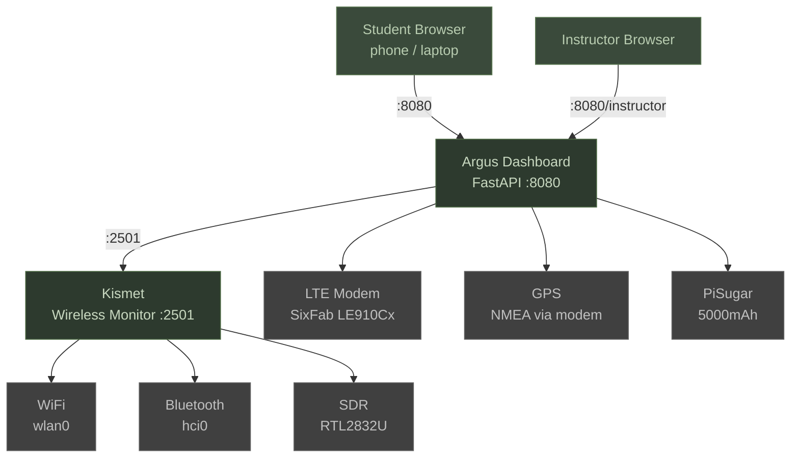

# Argus — RF Survey Payload Integrator


Software toolkit for the **Robotics Capabilities Course** Module 4.3:
Raspberry Pi Payload Integrator. Transforms a Raspberry Pi 4 into a deployable
RF survey payload for robotics platforms.

## Architecture



## Quick Start

```bash
# 1. Flash Kali Linux ARM64 onto SD card (use RPi Imager)
# 2. Clone the repo
git clone https://github.com/rmeadomavic/argus.git
cd argus

# 3. Run the one-click installer
sudo bash scripts/argus-setup.sh

# 4. Open the dashboard
# http://<pi-ip>:8080
```

## Hardware

| Component | Model | Purpose |
|-----------|-------|---------|
| SBC | Raspberry Pi 4 8GB | Main compute |
| OS | Kali Linux ARM64 | Base operating system |
| LTE | SixFab LE910Cx hat | Cellular connectivity |
| Battery | PiSugar 5000mAh | Portable power |
| SDR | Nooelec SMART (RTL2832U) | RF reception |
| Storage | 128GB+ SD card | OS + capture data |

## Dashboard

### Operations
- **Live View** — Real-time device list with signal, MAC, type, packet count; animated stat cards with pulse glow
- **Hunt Mode** — Track target by SSID or MAC address with WARMER/COLDER feedback (WiFi + Bluetooth)
- **Spectrum** — Channel utilization chart, band donut, device type donut, signal heatmap
- **Leaderboard** — Top-8 most active devices with live-updating packet-count bars
- **Map** — Leaflet map with logarithmic bubble markers, rich popups, GPS breadcrumb trail
- **Logs** — Structured log viewer with level filter, pause/resume, auto-scroll, auto-retry
- **Export** — KML for Google Earth, CSV for analysis, with live device/GPS status bar
- **RF Mission Profiles** — Switch between WiFi Survey, Bluetooth Recon, TPMS, ADS-B, Full Spectrum

### Settings
- **Config Editor** — Edit all settings from the browser (APN, Kismet sources, GPS, WiFi)
- **APN Management** — Carrier dropdown with common APNs (T-Mobile, AT&T, Verizon, FirstNet)
- **Password** — Set a dashboard login password for public network access
- **Import/Export** — Share configurations between devices
- **WiFi Capture Toggle** — Switch wlan0 between connectivity and monitor mode from the UI

### Preflight
- **Visual Checklist** — Hardware, services, network, and config checks with pass/warn/fail/N/A indicators
- **Auto-refresh** — Continuous monitoring of system health
- **18 checks** — Disk space, NTP sync, GPS fix, Kismet credentials, adapter conflicts, and more

### Instructor Overview
- **Multi-Device View** — Monitor all Pi payloads from a single browser tab
- **Real-time Status** — Kismet, GPS, LTE, battery, device count per Pi
- **Access:** `http://<any-pi-ip>:8080/instructor`

### Password Protection

Set `password` in `[dashboard]` of `argus.ini` to require login. Leave blank for open access.
When set, all pages and APIs require authentication. `/api/status` stays open for instructor polling.
Sessions expire after `session_timeout_min` minutes (default: 480 = 8 hours).

### Security
- **Token Auth** — Optional bearer token for control endpoints; dashboard bypasses via same-origin
- **TLS Support** — HTTPS available for production deployments
- **Event Logging** — SHA-256 hash-chained JSONL audit trail for chain-of-custody integrity

### ATAK Integration
- **CoT Export** — `/api/cot` generates MIL-STD-2525 Cursor-on-Target XML for all GPS-located devices
- **Self-Position** — `/api/cot/self` broadcasts the Pi's own position as a friendly sensor platform
- **Per-Device CoT** — `/api/cot/{mac}` for targeting specific devices
- **Waypoint Export** — `/api/waypoints` generates Mission Planner compatible waypoint files

## RF Mission Profiles

| Profile | Sources | Use Case |
|---------|---------|----------|
| WiFi Survey | WiFi + Bluetooth | Scan all access points and clients |
| Bluetooth Recon | Bluetooth only | BLE and Classic device discovery |
| TPMS Monitoring | Bluetooth + RTL-433 @ 433MHz | Vehicle tire pressure sensors |
| ADS-B Aircraft | Bluetooth + ADS-B @ 1090MHz | Aircraft transponder tracking |
| Full Spectrum | All sources | Complete RF survey |

## Student Exercises

| # | Exercise | Objective | Expected Outcome |
|---|----------|-----------|------------------|
| 1 | RF Survey | Fly the payload over an area, map all WiFi/BT devices | KML file opens in Google Earth showing device locations with signal data |
| 2 | WiFi Hunt | Locate a hidden access point using Hunt Mode | Signal strength reaches > -50 dBm; student identifies the AP's physical location |
| 3 | RF Recording | Capture raw RF signals with GQRX and RTL-SDR | Saved `.raw` recording file viewable in GQRX waterfall display |
| 4 | TPMS Monitoring | Detect vehicle tire pressure sensors at 433 MHz | TPMS device entries appear in the Live View device list |
| 5 | Cellular Recon | Use gr-gsm and IMSI-catcher (instructor-led) | Cell tower list and subscriber data captured per instructor guidance |
| 6 | KML Export | Export survey results to Google Earth | `.kml` file with placemarks rendered on the map at correct GPS coordinates |

## Configuration

All settings live in `config/argus.ini`. Edit via the dashboard Settings tab
or directly on the Pi:

```bash
nano /opt/argus/config/argus.ini
```

Key settings:

| Key | Section | Purpose |
|-----|---------|---------|
| `apn` | `[lte]` | Carrier APN — blank for interactive prompt |
| `source_wifi` | `[kismet]` | WiFi adapter for monitor mode |
| `hostname` | `[general]` | mDNS hostname (e.g., `argus-pi.local`) |
| `password` | `[dashboard]` | Dashboard login password (empty = no login) |

See [docs/configuration.md](docs/configuration.md) for the full reference.

## Remote Access

```bash
# Set up Tailscale VPN
sudo bash scripts/setup-tailscale.sh

# SSH from anywhere
ssh <user>@<tailscale-ip>

# Dashboard from anywhere
http://<tailscale-ip>:8080
```

## Headless Field-Boot

Power on and the dashboard is ready — no monitor, no keyboard.

```bash
# With WiFi
sudo bash scripts/argus-headless.sh --ssid "ClassroomWiFi" --password "s3cret"

# LTE only
sudo bash scripts/argus-headless.sh --ethernet-only

# Custom hostname
sudo bash scripts/argus-headless.sh --hostname argus-pi-03
```

## Service Management

| Service | Purpose | Depends On |
|---------|---------|------------|
| `argus-boot` | GPS init, Avahi startup | ModemManager |
| `kismet` | Wireless monitoring | argus-boot |
| `argus-dashboard` | Web UI on :8080 | kismet |


```bash
# Check all services
systemctl status kismet argus-dashboard argus-boot

# View logs
journalctl -u argus-dashboard -f
journalctl -u kismet -f

# Restart services
sudo systemctl restart argus-dashboard
```

## API Endpoints

| Endpoint | Method | Purpose |
|----------|--------|---------|
| `/api/status` | GET | System health (Kismet, modem, GPS, battery, Tailscale, device count) |
| `/api/devices` | GET | All WiFi/BT devices from Kismet |
| `/api/target/{query}` | GET | Hunt Mode: live RSSI for target SSID or MAC |
| `/api/gps` | GET | Current GPS position |
| `/api/activity` | GET | Recent device discoveries, new/min rate |
| `/api/logs` | GET | Dashboard log entries from ring buffer |
| `/api/profiles` | GET | List RF mission profiles |
| `/api/profiles/switch` | POST | Switch active profile |
| `/api/config/full` | GET/POST | Read/write configuration |
| `/api/export/kml` | GET | Export as KML (Google Earth) |
| `/api/export/csv` | GET | Export as CSV |
| `/api/cot` | GET | CoT XML for all GPS-located devices (ATAK) |
| `/api/cot/self` | GET | CoT XML for Pi's own position |
| `/api/cot/{mac}` | GET | CoT XML for a single device |
| `/api/waypoints` | GET | Mission Planner waypoint file |
| `/api/wifi-capture/toggle` | POST | Toggle WiFi between connectivity and capture |
| `/api/preflight` | GET | Run hardware/service checks |
| `/api/events/history` | GET | Operator event audit trail |

Full OpenAPI schema available at `/docs` when running.

A committed schema snapshot is also available at `docs/api/openapi.json` (regenerate with `python3 scripts/export-openapi.py`).

## Troubleshooting

| Issue | Fix |
|-------|-----|
| No devices in Live View | Check Kismet: `systemctl status kismet` |
| LTE not connecting | Verify APN in Settings tab. Modem index auto-detected. |
| No GPS fix | Move to open sky area, check preflight GPS Fix status |
| Dashboard not loading | Check: `systemctl status argus-dashboard` |
| Dashboard requires login | Password is set in `[dashboard] password`. Clear it to disable. |
| SDR not detected | Replug the Nooelec dongle, check `lsusb` |
| Bluetooth missing | Run `sudo hciconfig hci0 up`, check `hciconfig` |
| WiFi capture 0 packets | Onboard brcmfmac is unreliable; use external USB adapter (Alpha cards) |
| Session expired | Re-enter password at `/login`. Timeout is `session_timeout_min` in config. |

## Validation

```bash
# Full preflight check
bash scripts/argus-preflight.sh

# JSON output (used by dashboard)
bash scripts/argus-preflight.sh --json
```

## Course Materials

Slides are in `courseware/`:
- `4.3 Raspberry Pi Payload Integrator_v2 - Copy.pptx` — Full lesson plan
- `Slide1.JPG` through `Slide29.JPG` — Individual slides for reference
