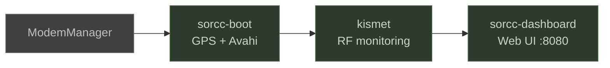

# SORCC-PI — RF Survey Payload Integrator


Software toolkit for the **Special Operations Robotics Capabilities Course (SORCC)**
Module 4.3: Raspberry Pi Payload Integrator. Transforms a Raspberry Pi 4 into a
deployable RF survey payload for robotics platforms.

## Architecture


## Quick Start

```bash
# 1. Flash Kali Linux ARM64 onto SD card (use RPi Imager)
# 2. Clone the repo
git clone https://github.com/rmeadomavic/sorcc-pi.git
cd sorcc-pi

# 3. Run the one-click installer
sudo bash scripts/sorcc-setup.sh

# 4. Open the dashboard
# http://<pi-ip>:8080
```

## Hardware

| Component | Model | Purpose |
|-----------|-------|---------|
| SBC | Raspberry Pi 4 8GB | Main compute |
| OS | Kali Linux ARM64 | Base operating system |
| LTE | SixFab LE910Cx hat | Cellular connectivity |
| Battery | PiSugar 5000mAh | Portable power |
| SDR | Nooelec SMART (RTL2832U) | RF reception |
| Storage | 128GB+ SD card | OS + capture data |

## Dashboard

| Feature | Page | Description |
|---------|------|-------------|
| Live View | Operations | Real-time device list — signal strength, MAC, type, packet count |
| Hunt Mode | Operations | Enter a target SSID, track signal with WARMER/COLDER feedback |
| RF Profiles | Operations | Switch between WiFi Survey, Bluetooth Recon, TPMS, ADS-B, Full Spectrum |
| Export | Operations | Download KML for Google Earth or CSV for analysis |
| Config Editor | Settings | Edit all tunables from the browser — APN, Kismet sources, GPS, WiFi |
| Password | Settings | Set a dashboard login password for public network access |
| Import/Export | Settings | Share configurations between devices as JSON |
| Preflight | Preflight | Hardware, service, network, and config checks with pass/warn/fail |
| Instructor View | `/instructor` | Monitor all Pi payloads from a single browser tab — Kismet, GPS, LTE, battery per device |

### Password Protection

Set `password` in `[dashboard]` of `sorcc.ini` to require login. Leave blank for open access.
When set, all pages and APIs require authentication. `/api/status` stays open for instructor polling.
Sessions expire after `session_timeout_min` minutes (default: 480 = 8 hours).

## RF Mission Profiles

| Profile | Sources | Use Case |
|---------|---------|----------|
| WiFi Survey | WiFi + Bluetooth | Scan all access points and clients |
| Bluetooth Recon | Bluetooth only | BLE and Classic device discovery |
| TPMS Monitoring | Bluetooth + RTL-433 @ 433MHz | Vehicle tire pressure sensors |
| ADS-B Aircraft | Bluetooth + ADS-B @ 1090MHz | Aircraft transponder tracking |
| Full Spectrum | All sources | Complete RF survey |

## Student Exercises

| # | Exercise | Objective | Expected Outcome |
|---|----------|-----------|------------------|
| 1 | RF Survey | Fly the payload over an area, map all WiFi/BT devices | KML file opens in Google Earth showing device locations with signal data |
| 2 | WiFi Hunt | Locate a hidden access point using Hunt Mode | Signal strength reaches > -50 dBm; student identifies the AP's physical location |
| 3 | RF Recording | Capture raw RF signals with GQRX and RTL-SDR | Saved `.raw` recording file viewable in GQRX waterfall display |
| 4 | TPMS Monitoring | Detect vehicle tire pressure sensors at 433 MHz | TPMS device entries appear in the Live View device list |
| 5 | Cellular Recon | Use gr-gsm and IMSI-catcher (instructor-led) | Cell tower list and subscriber data captured per instructor guidance |
| 6 | KML Export | Export survey results to Google Earth | `.kml` file with placemarks rendered on the map at correct GPS coordinates |

## Configuration

All settings live in `config/sorcc.ini`. Edit via the dashboard Settings tab
or directly on the Pi:

```bash
nano /opt/sorcc/config/sorcc.ini
```

Key settings:

| Key | Section | Purpose |
|-----|---------|---------|
| `apn` | `[lte]` | Carrier APN — blank for interactive prompt |
| `source_wifi` | `[kismet]` | WiFi adapter for monitor mode |
| `hostname` | `[general]` | mDNS hostname (e.g., `sorcc-pi.local`) |
| `password` | `[dashboard]` | Dashboard login password (empty = no login) |

See [docs/configuration.md](docs/configuration.md) for the full reference.

## Remote Access

```bash
# Set up Tailscale VPN
sudo bash scripts/setup-tailscale.sh

# SSH from anywhere
ssh <user>@<tailscale-ip>

# Dashboard from anywhere
http://<tailscale-ip>:8080
```

## Headless Field-Boot

Power on and the dashboard is ready — no monitor, no keyboard.

```bash
# With WiFi
sudo bash scripts/sorcc-headless.sh --ssid "ClassroomWiFi" --password "s3cret"

# LTE only
sudo bash scripts/sorcc-headless.sh --ethernet-only

# Custom hostname
sudo bash scripts/sorcc-headless.sh --hostname sorcc-pi-03
```

## Service Management

| Service | Purpose | Depends On |
|---------|---------|------------|
| `sorcc-boot` | GPS init, Avahi startup | ModemManager |
| `kismet` | Wireless monitoring | sorcc-boot |
| `sorcc-dashboard` | Web UI on :8080 | kismet |



```bash
# Check all services
systemctl status kismet sorcc-dashboard sorcc-boot

# View logs
journalctl -u sorcc-dashboard -f
journalctl -u kismet -f

# Restart services
sudo systemctl restart sorcc-dashboard
```

## Troubleshooting

| Issue | Fix |
|-------|-----|
| No devices in Live View | Check Kismet: `systemctl status kismet` |
| LTE not connecting | Verify APN in Settings tab or `sudo mmcli -m 0` |
| No GPS fix | Move to open sky, check `sudo mmcli -m 0 --location-get` |
| Dashboard not loading | Check: `systemctl status sorcc-dashboard` |
| Dashboard requires login | Password is set in `[dashboard] password`. Clear it to disable. |
| SDR not detected | Replug the Nooelec dongle, check `lsusb` |
| Bluetooth missing | Run `sudo hciconfig hci0 up`, check `hciconfig` |
| Session expired | Re-enter password at `/login`. Timeout is `session_timeout_min` in config. |

## Validation

```bash
# Full preflight check
bash scripts/sorcc-preflight.sh

# JSON output (used by dashboard)
bash scripts/sorcc-preflight.sh --json
```

## Course Materials

Slides are in `courseware/`:
- `4.3 Raspberry Pi Payload Integrator_v2 - Copy.pptx` — Full lesson plan
- `Slide1.JPG` through `Slide29.JPG` — Individual slides for reference
